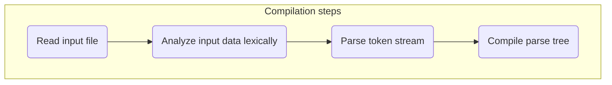

# ULPCL (ULP Compiler)

## In this document
* [Compiler overview](#compiler-overview)
* [Compilation steps](#compilation-steps)
* [Compiler options](#compiler-options)
* [Compiler errors and warnings](#compiler-errors-and-warnings)

## Compiler overview

ulpcl.exe is a command-line tool designed to convert human-readable [ULP](ulp.md) files into a binary format representation stored in [UMC](umc.md) files. It provides a range of options to customize compiler behavior and manage optional features, offering flexibility and control over the compilation process.

## Compilation steps

The following diagram shows how compilation steps:



> **Note**
> The compiler requires files to be encoded as UTF-8. Only UTF-8 BOM or no BOM is accepted.
> Please ensure compilance to prevent unexpected behavior during compilation.

The compilation process begins by reading the input file containing the message set. Subsequently, the compiler analyzes the input data lexically, breaking it down into tokens like keywords, identifiers, and literals. Following lexical analysis, the compiler parses the token stream to ensure adherence to the syntax rules of the [ULP](ulp.md) file format. During this parsing phase, the compiler constructs a parse tree representing the structure of the file's content. Finally, the compiler converts the generated parse tree into binary representation stored in the [UMC](umc.md) file. Additionally, depending on the options provided, it may also generate [symbol](sym.md) files which store the generated symbols and their locations. 

## Compiler options

The compiler offers a range of options, with some influencing the compilation process while others impacting the runtime behavior of the compiler.

### `--help`, `-h`

Displays help information about the compiler options and usage. When this flag is provided, the compiler prints out a summary of available options, usage instructions, and any additional information that might be helpful for users.

```
ulpcl --help
ulpcl -h
```

### `--version`, `-v`

Prints the version of the ULPCL compiler along with the compilation date.

```
ulpcl --version
ulpcl -v
```

### `--verbose`, `-V`

Enables detailed logging during the compilation process. When this flag is activated, the compiler provides additional information and logs, offering a more comprehensive view of the compilation process.

```
ulpcl --verbose
ulpcl -V
```

### `--input`

Specifies input files for compilation. The equal sign and quotes are required. This option adds the specified file to the queue of files to compile. Both absolute and relative paths are accepted. However, it's important to note that only files with the extension *.ulp* will be included for compilation. Any files with different extensions will be ignored.

```
ulpcl --input="D:\Project\translations\pl_PL.ulp"
ulpcl --input="translations\pl_PL.ulp"
```

### `--input-dir`

Specifies a directory to scan for *.ulp* files to include for compilation. This option adds all *.ulp* files found in the specified directory to the queue of files to compile. Both absolute and relative paths are accepted.

```
ulpcl --input-dir="D:\Project\translations"
ulpcl --input-dir="translations"
```

### `--output-dir`

Specifies the directory where compiled files will be placed. If this option isn't specified, the current directory is set as the output directory. Both absolute and relative paths are accepted. If the specified directory doesn't exist, the compiler will create it.

```
ulpcl --output-dir="D:\Project\translations\build"
ulpcl --output-dir="translations\build"
```

### `--error-model`

Specifies how errors and warnings impact the compilation process. You can choose one of the following options:
- `soft`: Halts the compiler on errors but allows warnings to proceed.
- `strict`: Halts the compiler on both errors and warnings.
- `default`: Sets the default error model, which is `soft`.

If this option isn't specified, the default error model is used.

```
ulpcl --error-model=soft
ulpcl --error-model=strict
ulpcl --error-model=default
```

### `--threads`

Specifies multithreading during compilation. It can be one of the following options:
- `disable`: Disables multithreading completly.
- `auto`: Automatically chooses the number of threads, allowing multithreading.
- `<number>`: Sets a user-specified number of threads (limited to 1, 2, 4, or 8).

If this option isn't specified, multithreading is disabled.

```
ulpcl --threads=disable
ulpcl --threads=auto
ulpcl --threads=1
ulpcl --threads=2
ulpcl --threads=4
ulpcl --threads=8
```

### `--discard-empty`, `-d`

Specifies whether to discard messages that have no values. When this option is enabled, messages without associated values, such as `#msg-id: ""`, are not compiled. If this option isn't specified, the compiler compiles such messages, even though they have no associated value.

```
ulpcl --discard-empty
ulpcl -d
```

### `--symbol-file`, `-s`

Specifies whether to generate a [symbol](sym.md) file for each input file during compilation. When this option is enabled, the compiler generates a symbol file corresponding to each input file.

```
ulpcl --symbol-file
ulpcl -s
```

## Compiler errors and warnings

For a comprehensive list of compiler errors and warnings, please refer to [this](cl_err_wrn.md) document.