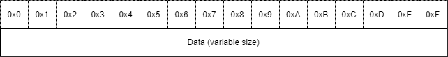

# UFUI Message Catalog (UMC)

The *.umc* files represent binary compilations of *.ulp* files,
achieved through the processing of [ULPCL](compiler.md) compiler.
They contain the transformed data from the original human-readable
[ULP](ulp.md) files into a binary format suitable for efficient
storage and processing.

## Usage

The *.umc* files are a component of the UFUI Multi-Language Support (UMLS) API, which forms part of the broader [User-Friendly UI
(UFUI)](https://github.com/MateuszJanduraUszu/UFUI) project. It is recommended to utilize them in conjunction with these APIs, rather
than for direct usage, as they fully leverage the features provided by UMC files.

## File structure

The UMC file stores data in three sections: header, lookup table and blob.
The following tables show how data is stored.

### Header

A header consists of five fields:
1. **Signature**: A fixed 4-byte sequence of bytes that helps recognize the file format.
2. **Language length**: The length of the language name in terms of the number of UTF-8 characters.
3. **Language name**: The name of the language to which messages are translated. It is stored in UTF-8 encoding, and its length is
always equal to the value stored in the **language length** field.
4. **LCID (Locale ID)**: A 4-byte number intended to be compatible with Windows LCIDs, facilitating the automatic detection of the best
translation from installed catalogs.
5. **Number of messages**: Indicates the size of the lookup table, always requiring 4 bytes for storage.

### Lookup table

A lookup table consists of entries, each representing one message with three fields:
1. **Hash**: An 8-byte hash of the message ID computed using the [xxHash](https://github.com/Cyan4973/xxHash) algorithm.
2. **Offset**: An 8-byte offset of the message in the data blob.
3. **Length**: A 4-byte length of the message in the data blob, stored in UTF-8 encoding.

The number of entries is stored in the header's field called **Number of messages**.

### Blob

A blob stores all messages concatenated into one byte block, with each message encoded in UTF-8. To access a specific message, the
associated lookup table entry is used.